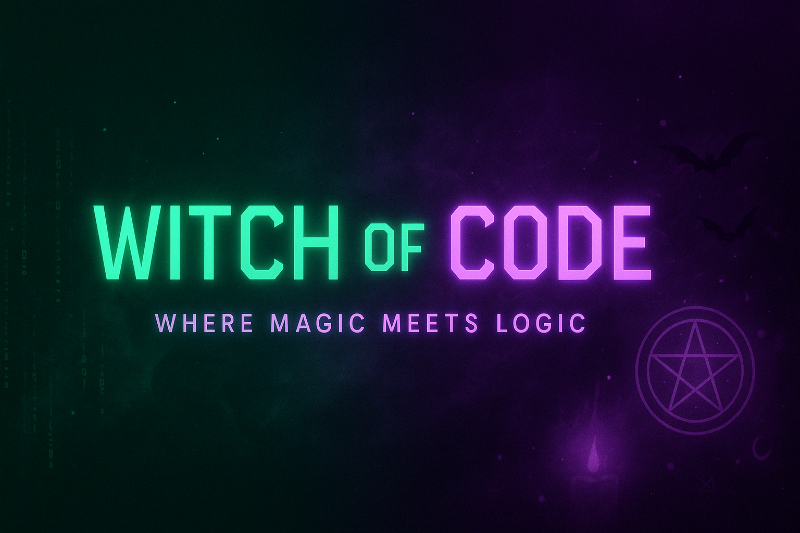

  

<h1 align="center">🧬 About Me — Witch of Code 🪄</h1>

  

---

<h3 align="center">🌍 Current Journey</h3>

  🗺️ <strong>I’m working on</strong> → <em>moving to Latin America</em> 💃 
  📚 <strong>I’m currently learning</strong> → <em>everything I can find on self-study IT</em> 🧑‍💻 
  🧙‍♀️ <strong>I want to collaborate on</strong> → <em>playing DnD in Russian — forever & always</em> 🎲 
  🧭 <strong>Looking for help with</strong> → <em>anything you can offer for my development</em> 📈

---

<h3 align="center">📜 Curiosities</h3>

  📖 <strong>Ask me about</strong> → <em>any fantasy universe — I always have a tale to tell</em> 🦄 
  🧚‍♀️ <strong>Fun Fact</strong> → <em>I'm someone in between the Fey and the Undead</em> 🧛‍♀️ 
  👑 <strong>Pronouns</strong> → <em>She/Her — Witch of Code</em> 🪄

---

<h3 align="center">📨 Social Media</h3>

  
  
  

---

<h3 align="center">🧾 Certificates</h3>

  
    
  

---

<h3 align="center">🧪 Skills & Tools</h3>

  
  
  
  
  
  

---

<h3 align="center">⚔️ Code & Magic</h3>

  

---

<h3 align="center">📌 Pinned Realms</h3>

  

---

<h3 align="center">📊 GitHub Stats & Contributions</h3>

  
    
  

---

  🔮 Crafted with care, magic, and arcane flair by <strong>Witch of Code</strong> 🪄

